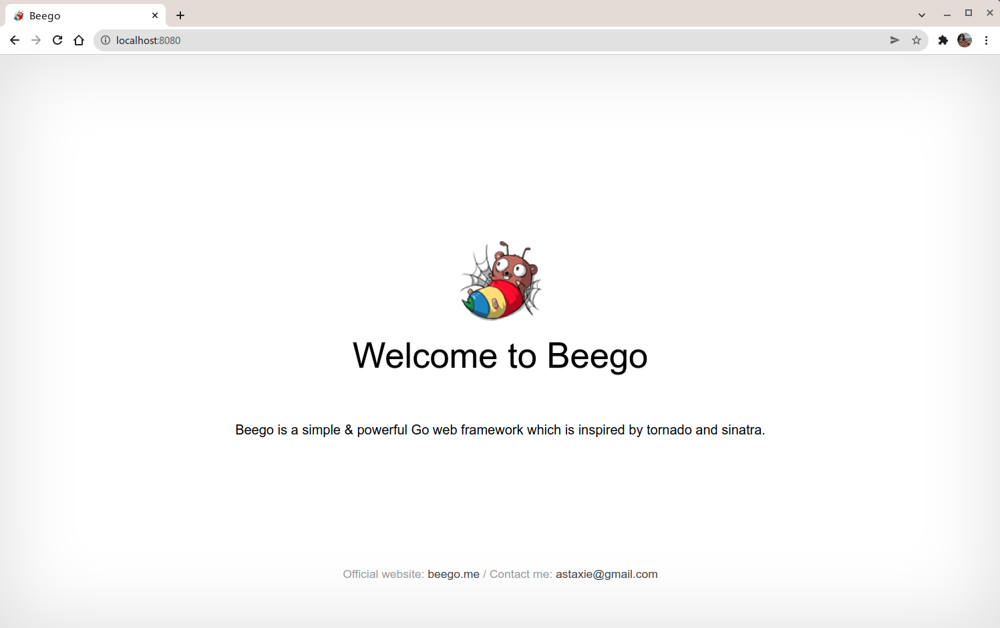
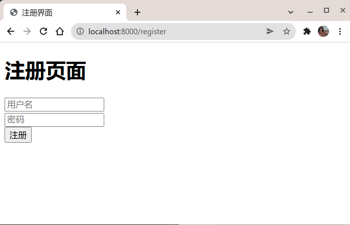
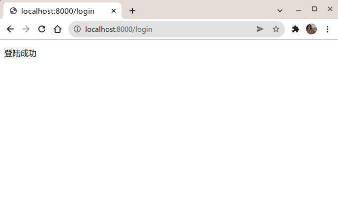

# Beego 登陆和注册

## 说明
这个小样是`Beego`框架的简单实例，实现了如何用`bee`工具自动生成项目的基本结构。

## Beego的安装
要想构建`Beego`项目需要下载安装`Beego`框架和`Bee`工具。
### Beego
`Beego`框架的安装很简单，只需要执行下面的代码就行:
```go
go get -u github.com/beego/beego/v2
```
这样`Beego`框架就安装好了。

### Bee
想要快速创建项目，还需要安装`Bee`工具:
```go
go get -u github.com/beego/bee/v2
```
安装好了`Bee`工具之后，需要将`Bee`所在目录`$GOPATH/bin`加入到`$PATH`环境变量中，`Linux`系统可以直接将二进制文件`bee`复制到`/usr/local/bin/`目录下。

## 快速入门
`Beego`是一个能够进行快速开发应用的框架。
### 新建项目
`Beego`的项目基本都是通过`bee`命令来创建的。打开终端，进入你要创建项目的位置的路径:
```go
$ bee new beego-demo
2021/01/05 10:39:11 INFO     ▶ 0001 generate new project support go modules.
2021/01/05 10:39:11 INFO     ▶ 0002 Creating application...
create	 /home/imw7/beego-demo/go.mod
create	 /home/imw7/beego-demo/
create	 /home/imw7/beego-demo/conf/
create	 /home/imw7/beego-demo/controllers/
create	 /home/imw7/beego-demo/models/
create	 /home/imw7/beego-demo/routers/
create	 /home/imw7/beego-demo/tests/
create	 /home/imw7/beego-demo/static/
create	 /home/imw7/beego-demo/static/js/
create	 /home/imw7/beego-demo/static/css/
create	 /home/imw7/beego-demo/static/img/
create	 /home/imw7/beego-demo/views/
create	 /home/imw7/beego-demo/conf/app.conf
create	 /home/imw7/beego-demo/controllers/default.go
create	 /home/imw7/beego-demo/views/index.tpl
create	 /home/imw7/beego-demo/routers/router.go
create	 /home/imw7/beego-demo/tests/default_test.go
create	 /home/imw7/beego-demo/main.go
2021/01/05 10:39:11 SUCCESS  ▶ 0003 New application successfully created!
```
通过`tree`命令可以查看`beego-demo`项目的结构:
```bash
beego-demo
├── conf
│   └── app.conf
├── controllers
│   └── default.go
├── go.mod
├── main.go
├── models
├── routers
│   └── router.go
├── static
│   ├── css
│   ├── img
│   └── js
│       └── reload.min.js
├── tests
│   └── default_test.go
└── views
    └── index.tpl
```
从目录结构中可以看出来这是一个典型的`MVC`架构的应用，`main.go`是入口文件。

### 运行项目
`beego`项目创建之后，就可以开始运行项目，使用`bee run`来运行项目，这样就可以做到热编译的效果：
```go
$ bee run
______
| ___ \
| |_/ /  ___   ___
| ___ \ / _ \ / _ \
| |_/ /|  __/|  __/
\____/  \___| \___| v2.0.2
2022/01/05 10:55:27 WARN     ▶ 0001 Running application outside of GOPATH
2022/01/05 10:55:27 INFO     ▶ 0002 Using 'beego-demo' as 'appname'
2022/01/05 10:55:27 INFO     ▶ 0003 Initializing watcher...
2022/01/05 10:55:29 SUCCESS  ▶ 0004 Built Successfully!
2022/01/05 10:55:29 INFO     ▶ 0005 Restarting 'beego-demo'...
2022/01/05 10:55:29 SUCCESS  ▶ 0006 './beego-demo' is running...
2022/01/05 10:55:29.269 [I] [parser.go:413]  generate router from comments

2022/01/05 10:55:29.269 [I] [server.go:241]  http server Running on http://:8080
```
这样应用就已经在`8080`端口（beego的默认端口）跑起来了。


## 注册
### view

首先准备视图在`views`文件夹下新建`register.html`，写入如下代码:

```html
<!DOCTYPE html>
<html lang="en">
<head>
    <meta charset="UTF-8">
    <meta http-equiv=X-UA-Compatible content="IE=edge">
    <meta name=viewport content="width=device-width,initial-scale=1">
    <link rel=icon href="/static/img/favicon.ico">
    <title>注册界面</title>
</head>
<body>

<h1>注册页面</h1>
<form method="post" action="/register">
    <label>
        <input type="text" name="username" placeholder="用户名">
    </label>
    <br>
    <label>
        <input type="password" name="password" placeholder="密码">
    </label>
    <br>
    <input type="submit" value="注册">
    <span style="color: red; font-size: small">{{ .errMsg }}</span>
</form>

</body>
</html>
```

### model

首先登陆`mysql`，创建数据库`my_test`。

```mysql
mysql> CREATE DATABASE my_test
```

在`models`文件夹下新建`model.go`，写入代码：

```go
package models

import (
	"github.com/beego/beego/v2/client/orm"
	"github.com/beego/beego/v2/core/logs"
	_ "github.com/go-sql-driver/mysql"
)

// User 用户信息
type User struct {
	Id   int
	Name string `orm:"unique"` // 用户名唯一
	Pwd  string
}

func init() {
	// 设置数据库基本信息
	if err := orm.RegisterDataBase("default", "mysql", "root:password@tcp(127.0.0.1:3306)/my_test?charset=utf8"); err != nil {
		logs.Error(err)
	}
	// 映射model数据库
	orm.RegisterModel(&User{})
	// 生成表
	if err := orm.RunSyncdb("default", false, true); err != nil {
		logs.Error(err)
	}
}
```

### controller

在`controllers`文件夹下的`default.go`中写入代码：

```go
package controllers

import (
	"beego-demo/models"
	"github.com/beego/beego/v2/client/orm"
	"github.com/beego/beego/v2/core/logs"
	beego "github.com/beego/beego/v2/server/web"
	"net/http"
	"strings"
)

type MainController struct {
	beego.Controller
}

// RegisterGet 注册展示页面
func (c *MainController) RegisterGet() {
	c.TplName = "register.html"
}

// RegisterPost 注册获取数据页面
func (c *MainController) RegisterPost() {
	// 1.拿到数据，并去除两边的空格
	username := strings.TrimSpace(c.GetString("username"))
	password := strings.TrimSpace(c.GetString("password"))
	// 2.对数据进行校验
	if username == "" || password == "" {
		logs.Error("用户名或密码不能为空")
		c.Redirect("/register", http.StatusFound)
		return
	}
	// 3.插入数据库
	o := orm.NewOrm()
	user := models.User{
		Name: username,
		Pwd:  password,
	}
	_, err := o.Insert(&user)
	if err != nil {
		logs.Error("insert failed, err:", err)
		c.Redirect("/register", http.StatusNotFound)
		return
	}
	// 4.返回登陆界面
	// c.TplName = "login.html" // 指定视图文件，同时可以给这个视图传递一些数据
	c.Redirect("/login", http.StatusFound) // 跳转，不能传递数据，速度快
}
```

### routers

最后在`routers`文件夹的`router.go`文件中写入如下代码：

```go
package routers

import (
	"beego-demo/controllers"
	beego "github.com/beego/beego/v2/server/web"
)

func init() {
	beego.Router("/register", &controllers.MainController{}, "get:RegisterGet;post:RegisterPost")
}
```

这样，注册功能就简单实现了。

## 登陆

登陆功能的流程和注册功能基本相同。

### view

首先准备视图在`views`文件夹下新建`login.html`，写入如下代码:

```html
<!DOCTYPE html>
<html lang="en">
<head>
    <meta charset="UTF-8">
    <meta http-equiv=X-UA-Compatible content="IE=edge">
    <meta name=viewport content="width=device-width,initial-scale=1">
    <link rel=icon href="/static/img/favicon.ico">
    <title>登录界面</title>
</head>
<body>

<h1>登陆界面</h1>
<form method="post" action="/login">
    <label>
        <input type="text" name="username" placeholder="用户名">
    </label>
    <br>
    <label>
        <input type="password" name="password" placeholder="密码">
    </label>
    <br>
    <input type="submit" value="登陆">
    <span style="color: red; font-size: small">{{ .errMsg }}</span>
</form>

</body>
</html>
```

### model

`model.go`文件没有新增内容。

### controller

在`controllers`文件夹下的`default.go`中写入代码：

```go
package controllers

import (
	"beego-demo/models"
	"github.com/beego/beego/v2/client/orm"
	"github.com/beego/beego/v2/core/logs"
	beego "github.com/beego/beego/v2/server/web"
	"net/http"
	"strings"
)

type MainController struct {
	beego.Controller
}

// RegisterGet 注册展示页面
func (c *MainController) RegisterGet() {
	c.TplName = "register.html"
}

// RegisterPost 注册获取数据页面
func (c *MainController) RegisterPost() {
	// 1.拿到数据，并去除两边的空格
	username := strings.TrimSpace(c.GetString("username"))
	password := strings.TrimSpace(c.GetString("password"))
	// 2.对数据进行校验
	if username == "" || password == "" {
		logs.Error("用户名或密码不能为空")
		c.Redirect("/register", http.StatusFound)
		return
	}
	// 3.插入数据库
	o := orm.NewOrm()
	user := models.User{
		Name: username,
		Pwd:  password,
	}
	_, err := o.Insert(&user)
	if err != nil {
		logs.Error("insert failed, err:", err)
		c.Redirect("/register", http.StatusNotFound)
		return
	}
	// 4.返回登陆界面
	// c.TplName = "login.html" // 指定视图文件，同时可以给这个视图传递一些数据
	c.Redirect("/login", http.StatusFound) // 跳转，不能传递数据，速度快
}

// LoginGet 登陆页面get方法
func (c *MainController) LoginGet() {
	c.TplName = "login.html"
}

// LoginPost 登陆页面post方法
func (c *MainController) LoginPost() {
	// 1.拿到数据，并去除两边的空格
	username := strings.TrimSpace(c.GetString("username"))
	password := strings.TrimSpace(c.GetString("password"))
	logs.Info("username:", username, "password:", password)
	// 2.判断数据是否合法
	if username == "" || password == "" {
		logs.Error("用户名或密码不能为空")
		c.TplName = "login.html"
		c.Data["errMsg"] = "登陆失败"
	}
	// 3.查询账号密码是否正确
	o := orm.NewOrm()
	user := models.User{}
	user.Name = username
	if err := o.Read(&user, "Name"); err != nil {
		logs.Info("用户名错误")
		c.TplName = "login.html"
		c.Data["errMsg"] = "用户名或密码错误"
		return
	}
	// 判断密码是否一致
	if user.Pwd != password {
		logs.Info("密码错误")
		c.TplName = "login.html"
		c.Data["errMsg"] = "用户名或密码错误"
		return
	}
	// 4.跳转
	c.Ctx.WriteString("登陆成功")
}
```

### routers

最后在`routers`文件夹的`router.go`文件中写入如下代码：

```go
package routers

import (
	"beego-demo/controllers"
	beego "github.com/beego/beego/v2/server/web"
)

func init() {
	beego.Router("/register", &controllers.MainController{}, "get:RegisterGet;post:RegisterPost")
    beego.Router("/login", &controllers.MainController{}, "get:LoginGet;post:LoginPost")
}
```

就这样，登陆功能也实现了。

## 效果展示
在浏览器中打开`localhost:8000/register`可进入注册界面。



输入用户名和密码后，点击注册，注册成功会跳转到登录界面。在登陆界面输入正确的用户名和密码后，就会跳转到登陆成功界面。



这样，利用`Beego`框架就实现了简单的登陆和注册功能。
